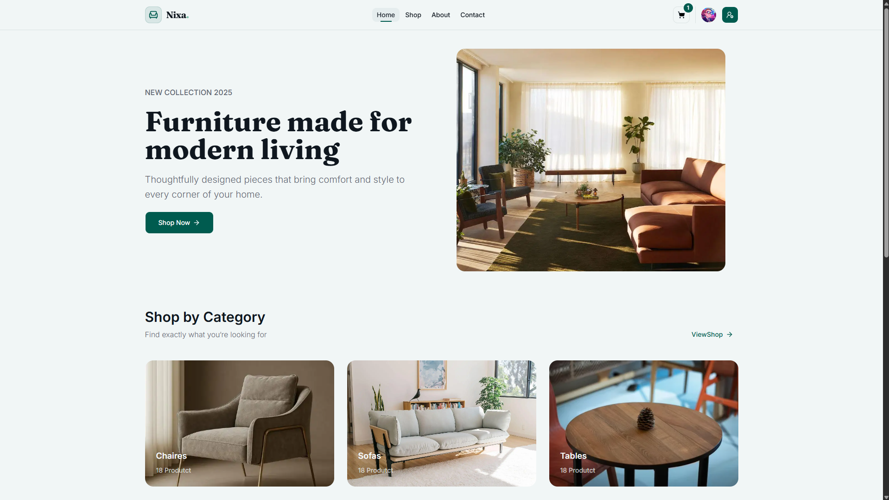
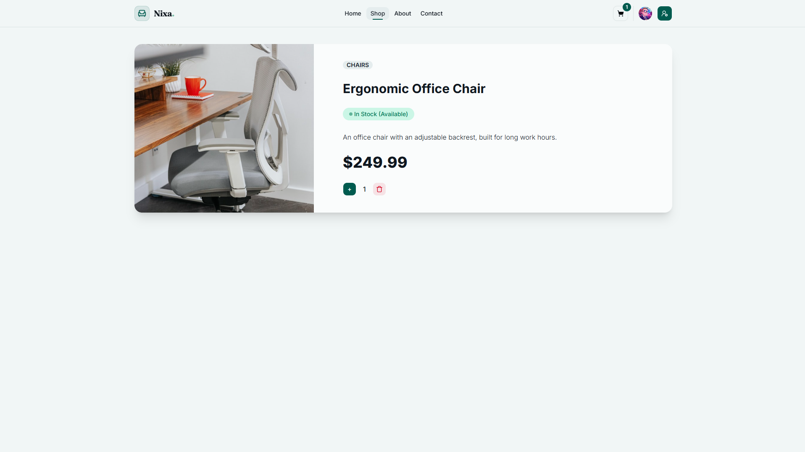
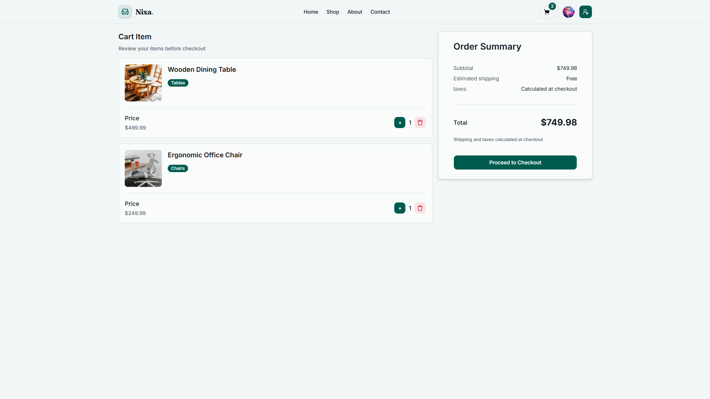
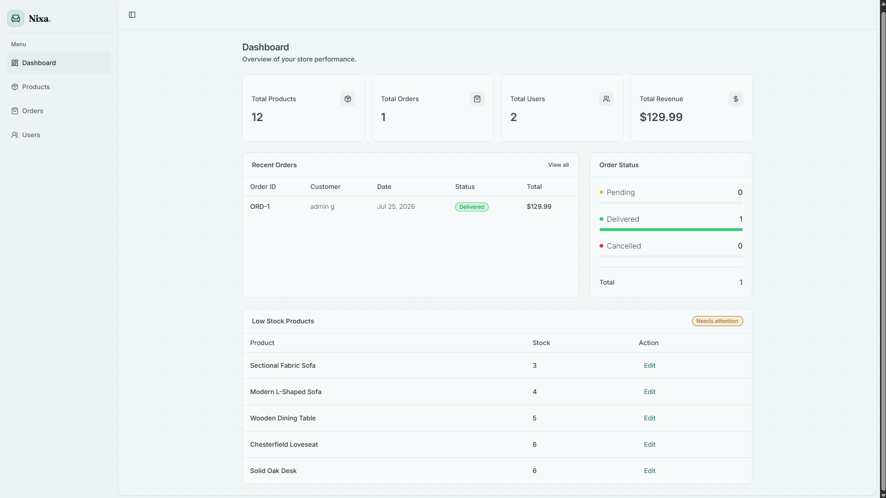

[](https://reactjs.org/)
[](https://nextjs.org/)
[](https://vercel.com/)

# 🛍️ NIXA

**NIXA** is a full-stack e-commerce application built with
**Next.js**, **React**, **TypeScript**, **Prisma**, and **PostgreSQL**.

The platform provides a complete shopping experience, including product
browsing, product details, shopping cart management, checkout, order tracking,
and user account management.

It also includes an admin dashboard for managing products, users, and orders.

## ✨ Features

- 🔐 **Authentication** — User registration, login, and protected routes
- 🛍️ **Product Catalog** — Browse products and view detailed product information
- 🛒 **Shopping Cart** — Add products, update quantities, and remove items
- 💳 **Checkout System** — Complete the checkout process and place orders
- 📦 **Order Management** — Create and manage customer orders
- 👤 **User Accounts** — Manage user profile and view order history
- 📊 **Admin Dashboard** — Manage products, users, and orders
- 📱 **Responsive Design** — Optimized for desktop and mobile devices

## 📸 Screenshots

### Home Page



### Product Details



### Shopping Cart



### Admin Dashboard



## Tech Stack

### Frontend

- [React 19.2.4](https://react.dev/)
- [Next.js 16.2.9](https://nextjs.org/)
- [TypeScript](https://www.typescriptlang.org/)

### Styling & UI

- [Tailwind CSS](https://tailwindcss.com/)
- [shadcn/ui](https://ui.shadcn.com/)
- [Radix UI](https://www.radix-ui.com/)
- [Lucide React](https://lucide.dev/)

### Forms & Validation

- [React Hook Form](https://react-hook-form.com/)
- [Zod](https://zod.dev/)

### Authentication & Security

- [Auth.js (NextAuth.js)](https://authjs.dev/)
- [bcryptjs](https://github.com/dcodeIO/bcrypt.js)

### Backend & Database

- [Prisma ORM](https://www.prisma.io/)
- [PostgreSQL](https://www.postgresql.org/)
- [Neon](https://neon.tech/)

### Data Tables

- [TanStack Table](https://tanstack.com/table)

### Utilities

- [Sonner](https://sonner.emilkowal.ski/)

---

## 🏗️ Architecture Decisions

- **Server Components for data fetching** — Fetch data directly from the database using Prisma without an unnecessary API layer.

- **URL-based state for product browsing** — Store product filters, search queries, sorting, and pagination in URL search parameters to keep the state shareable and persistent across navigation.

- **Server Actions for mutations** — Handle data mutations on the server with server-side validation and authorization.

- **Atomic checkout** — Use Prisma transactions to ensure that order creation, cart cleanup, and stock updates succeed or fail together.

## 🚀 Deployment

This project is deployed on Vercel. [Vercel](https://vercel.com/).  
You can access the live site here: [https://torino-app-two.vercel.app/](https://torino-app-two.vercel.app/)

## 🔑 Demo Account

You can use the following credentials to explore the admin dashboard:

**Email:** `admin@test.com`  
**Password:** `12345678`

## 🏁 Getting Started

### Installation

1. Clone the repository:

```bash
git clone https://github.com/omid-agazadehK/nixa.git
cd nixa
```

1. Install dependencies :

```bash
pnpm install

```

3. Add .env File :

```env
DATABASE_URL="your-database-url"
AUTH_SECRET="your-auth-secret"
```

4. Apply the Prisma database migrations:

```bash
pnpm prisma migrate dev
```

5. Seed the database with initial data:

```bash
pnpm prisma db seed
```

6. Running the Project :

```bash
pnpm dev
```

## 📄 Usage

This project was created for personal use and learning purposes.
Commercial use and redistribution are not permitted without permission.
